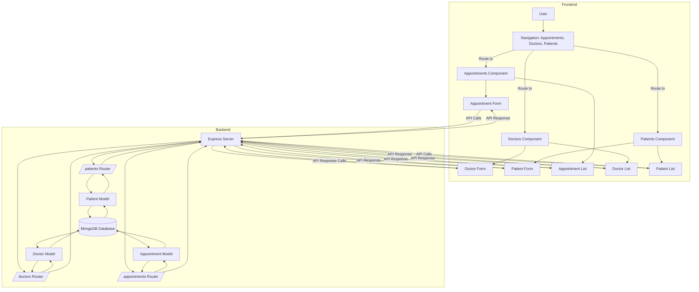

# Hospital Management System Flowchart

```mermaid
flowchart TD
    subgraph Frontend
        User[User]
        Navigation[Navigation: Appointments, Doctors, Patients]
        AppointmentsComp[Appointments Component]
        DoctorsComp[Doctors Component]
        PatientsComp[Patients Component]
        AppointmentForm[Appointment Form]
        DoctorForm[Doctor Form]
        PatientForm[Patient Form]
        AppointmentList[Appointment List]
        DoctorList[Doctor List]
        PatientList[Patient List]
    end

    subgraph Backend
        ExpressServer[Express Server]
        PatientsRouter[/patients Router/]
        DoctorsRouter[/doctors Router/]
        AppointmentsRouter[/appointments Router/]
        AppointmentModel[Appointment Model]
        DoctorModel[Doctor Model]
        PatientModel[Patient Model]
        MongoDB[(MongoDB Database)]
    end

    User --> Navigation
    Navigation -->|Route to| AppointmentsComp
    Navigation -->|Route to| DoctorsComp
    Navigation -->|Route to| PatientsComp

    AppointmentsComp --> AppointmentForm
    AppointmentsComp --> AppointmentList
    DoctorsComp --> DoctorForm
    DoctorsComp --> DoctorList
    PatientsComp --> PatientForm
    PatientsComp --> PatientList

    AppointmentForm -->|API Calls| ExpressServer
    AppointmentList -->|API Calls| ExpressServer
    DoctorForm -->|API Calls| ExpressServer
    DoctorList -->|API Calls| ExpressServer
    PatientForm -->|API Calls| ExpressServer
    PatientList -->|API Calls| ExpressServer

    ExpressServer --> PatientsRouter
    ExpressServer --> DoctorsRouter
    ExpressServer --> AppointmentsRouter

    PatientsRouter --> PatientModel
    DoctorsRouter --> DoctorModel
    AppointmentsRouter --> AppointmentModel

    AppointmentModel --> MongoDB
    DoctorModel --> MongoDB
    PatientModel --> MongoDB

    MongoDB --> AppointmentModel
    MongoDB --> DoctorModel
    MongoDB --> PatientModel

    AppointmentModel --> AppointmentsRouter
    DoctorModel --> DoctorsRouter
    PatientModel --> PatientsRouter

    PatientsRouter --> ExpressServer
    DoctorsRouter --> ExpressServer
    AppointmentsRouter --> ExpressServer

    ExpressServer -->|API Response| AppointmentForm
    ExpressServer -->|API Response| AppointmentList
    ExpressServer -->|API Response| DoctorForm
    ExpressServer -->|API Response| DoctorList
    ExpressServer -->|API Response| PatientForm
    ExpressServer -->|API Response| PatientList
```
